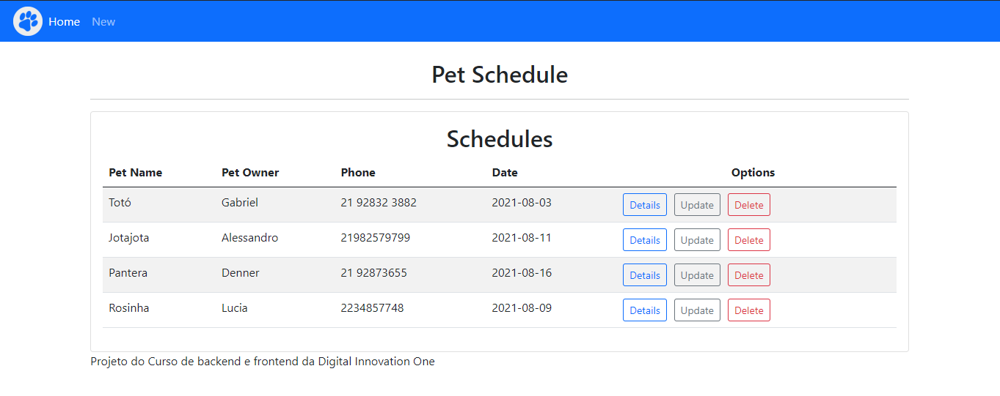

# Projeto final de Frontend e Backend - Bootcamp Santander DIO

## Como rodar o projeto?

### Requisitos:

* Java JDK 11
* IntelliJ 2021
* angular-cli

Installe o Java JDK 11 caso não tenha. 
Abra o projeto backend no Intellij e execute a classe principal. 
Endereço da API é: http://localhost:8081/api/v1/petschedule 
Essa API esta pronta para receber as requisições REST API (POST, PUT, DELETE, GET) 

Abra um terminal na pasta do frontend e execute o comando: 
ng serve 

### Home

Essa é a pagina inicial do projeto, onde contém a lista de agendamento 
dos Pets, com cadastro simples com nome, nome do dono, telefone e a data.

